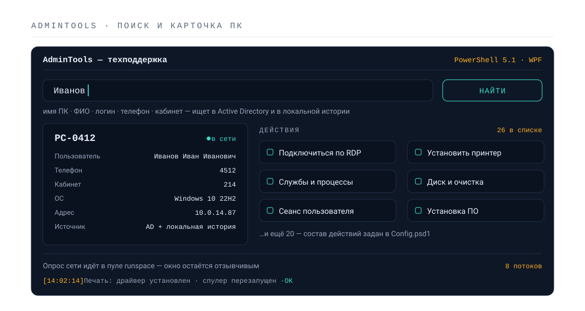
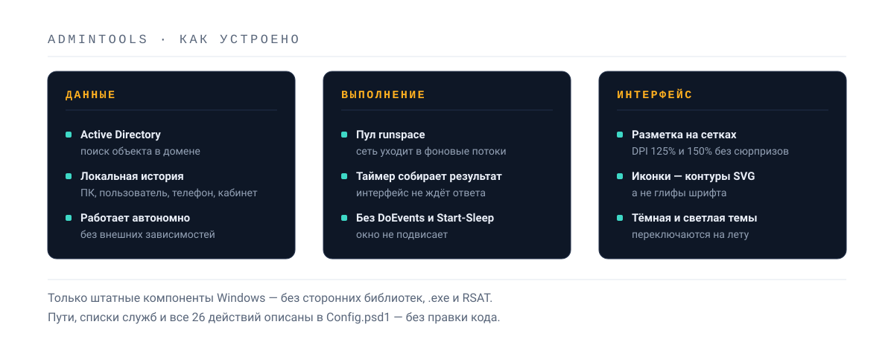
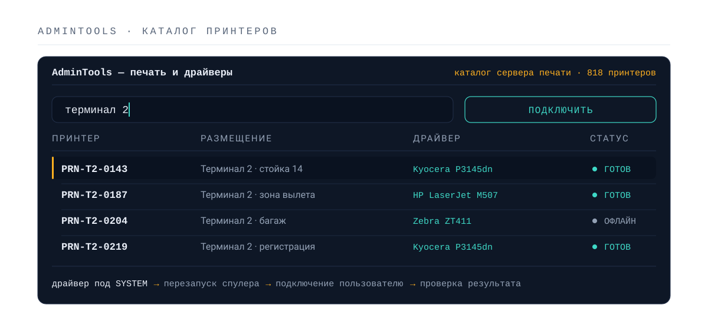
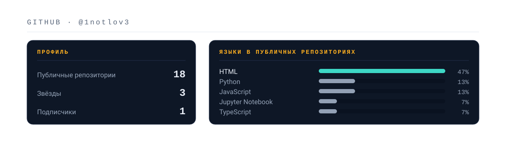

  <picture>
    <source media="(prefers-color-scheme: dark)" srcset="assets/hero-dark.svg">
    
  </picture>

  
  
  

**Специалист поддержки интеграций, вторая линия.** Разбираю эскалации по
внутренним системам компании: локализую сбой между приложением, базой данных,
сетью и внешними интеграциями и довожу проблему до причины — даже когда она не
на моей стороне.

Работаю с REST API, SQL, JSON и XML. Пишу на PowerShell и Python внутренние
инструменты автоматизации — самый большой из них, **AdminTools**, разобран
ниже.

🎓 Учусь на бакалавриате **«Прикладная информатика» (09.03.03)**, профиль
**«Искусственный интеллект и анализ данных»**, в Московском университете имени
С. Ю. Витте.

---

## 🧰 Разбор: AdminTools

Утилита техподдержки под Windows. Специалист вводит имя ПК — или ФИО, логин,
телефон, кабинет, что угодно — получает карточку машины и одним кликом выполняет
над ней любое из **26 действий**: подключение по RDP, установка принтера, работа
со службами, процессами и сеансами пользователя. Вместо прохода по нескольким
разным консолям — одно окно.

  <picture>
    <source media="(prefers-color-scheme: dark)" srcset="assets/admintools-ui-dark.svg">
    
  </picture>

Написана на **PowerShell 5.1 и WPF** и работает только на штатных компонентах
Windows: ни сторонних библиотек, ни `.exe`, ни RSAT — разворачивается там, где
поставить что-то дополнительное нельзя.

### Что внутри

- 🧭 **Поиск на двух ногах.** **Active Directory** и локальная накопительная
  история: программа запоминает каждый просмотренный ПК вместе с пользователем,
  телефоном и кабинетом, поэтому со временем находит машину даже по обрывку
  данных и не зависит от внешних источников;
- ⚡ **Ничего не зависает.** Вся работа с сетью уходит в **пул runspace**,
  результаты забирает таймер. В потоке интерфейса нет ни одного `DoEvents` и ни
  одного `Start-Sleep` — окно остаётся отзывчивым даже при опросе недоступной
  машины;
- 🗣 **Честность вместо видимости работы.** Недоступен сервер, лежит домен, не
  хватает дистрибутива — программа говорит об этом прямо и продолжает делать то,
  что может. Ошибки уходят в журнал, а не в пустой `catch`;
- 🖼 **Интерфейс на векторе.** Разметка только сетками, поэтому окно корректно
  тянется при DPI 125% и 150%. Иконки — контуры в нотации SVG, а не глифы
  шрифта: масштабируются без потерь и перекрашиваются под тему. Тёмная и светлая
  темы переключаются на лету;
- ⚙️ **Всё настраивается без правки кода.** Пути, списки служб и сами 26 действий
  лежат в `Config.psd1`.

  <picture>
    <source media="(prefers-color-scheme: dark)" srcset="assets/admintools-arch-dark.svg">
    
  </picture>

### Принтеры одним кликом

Отдельный экран: фильтр по каталогу, выбор принтера, кнопка «Подключить» — и
дальше программа сама ставит драйвер, перезапускает диспетчер печати, подключает
принтер пользователю и проверяет результат. Специалисту не нужно помнить
последовательность и держать открытыми оснастки.

  <picture>
    <source media="(prefers-color-scheme: dark)" srcset="assets/admintools-printers-dark.svg">
    
  </picture>

> Экраны выше — схемы интерфейса, а не снимки рабочего окна: AdminTools —
> внутренний инструмент, его содержимое наружу не выносится. Имена машин,
> принтеров и людей на схемах вымышленные.

**Стек:** PowerShell 5.1 · WPF · Active Directory · runspace pool · `Config.psd1`

---

## 🗂 Проекты

  <picture>
    <source media="(prefers-color-scheme: dark)" srcset="assets/projects-dark.svg">
    
  </picture>

| Проект | Что это | Стек |
| --- | --- | --- |
| **AdminTools** внутренний инструмент | Утилита техподдержки: поиск ПК по имени, ФИО, логину, телефону или кабинету и 26 действий над машиной | PowerShell 5.1 · WPF · Active Directory |
| **[Airport-It-Analytics](https://github.com/1notlov3/Airport-It-Analytics)** [→ живая панель](https://1notlov3.github.io/Airport-It-Analytics/dashboard/) | Учебная аналитика IT-поддержки аэропорта на сгенерированном датасете: 33 309 обращений, SLA, влияние инцидентов на рейсы | Python · pandas · SQL · Jupyter |
| **[Boltushka24](https://github.com/1notlov3/Boltushka24)** [→ boltushka24.vercel.app](https://boltushka24.vercel.app) | Мессенджер для сообществ: серверы и каналы, личные сообщения, реалтайм, голос и видео, совместный просмотр YouTube | Next.js · React · TypeScript · Supabase · Prisma · LiveKit |
| **[my-portfolio](https://github.com/1notlov3/my-portfolio)** [→ демо](https://1notlov3.github.io/my-portfolio/) | Личный сайт-портфолио: разделы о себе, навыках и проектах | React · JavaScript · CSS |
| **[aura-voice-landing](https://github.com/1notlov3/aura-voice-landing)** | Лендинг Aura, голосового AI-трекера калорий | HTML · CSS · JavaScript |

---

## ✈️ Разбор: аналитика аэропорта

  <picture>
    <source media="(prefers-color-scheme: dark)" srcset="assets/proof-dark.svg">
    
  </picture>

Учебный проект на **сгенерированном датасете**: смоделировал работу IT-поддержки
аэропорта, **33 309 обращений** за два года, проверил гипотезы, собрал панель и
написал рекомендации. Данные синтетические — с реальными обращениями
работодателя проект не связан.

- 🔍 нашёл узкое место сервиса: **31% срывов первичной реакции**, сосредоточенных в пиковые часы;
- 📈 связал нагрузку службы с расписанием рейсов (**r = 0,5**), поэтому её можно прогнозировать по расписанию;
- 💸 оценил операционную цену инцидентов: **≈655 задержанных рейсов в год**;
- 📊 собрал **[интерактивную панель](https://1notlov3.github.io/Airport-It-Analytics/dashboard/)**, её можно открыть в браузере.

**Стек:** Python (pandas, matplotlib, seaborn) · SQL (SQLite, оконные функции, CTE) · Jupyter · Chart.js

---

## 💬 Разбор: Boltushka24

  <picture>
    <source media="(prefers-color-scheme: dark)" srcset="assets/boltushka-dark.svg">
    
  </picture>

Фулстек-мессенджер для сообществ. Развернул на
**[boltushka24.vercel.app](https://boltushka24.vercel.app)**. Внутри серверы и
каналы, личные сообщения, реалтайм, голосовые и видеокомнаты, совместный
просмотр YouTube, роли и права, PWA с офлайн-очередью.

Инженерные решения:

- 🔒 **Реалтайм.** Шлю в броадкаст только `{ id, action }`, а контент клиент забирает через авторизованные API-роуты, поэтому приватные сообщения не попадают в публичный канал;
- ⚡ **Оптимистичная отправка.** Показываю сообщение сразу с временным id и меняю на реальный после ответа сервера. Пользователь не ждёт сеть;
- 🛡 **Права.** Проверяю роли `ADMIN`, `MODERATOR` и `GUEST` в одном модуле `lib/permissions.ts`.

**Стек:** Next.js · React · TypeScript · Tailwind · Supabase (Postgres, Realtime, Storage) · Prisma · Clerk · LiveKit · TanStack Query · Vercel

---

## 🧭 Опыт

| Период | Место | Роль |
| --- | --- | --- |
| окт 2025 — н.в. | Домодедово Хендлинг | Ведущий специалист технической поддержки, вторая линия |
| сен 2024 — апр 2025 | ФЦНИВТ СНПО «Элерон» | Старший техник, техническая и проектная документация |
| сен — дек 2023 | S7 IT | Стажёр, виртуальные рабочие места на VMware Horizon |
| сен 2022 — сен 2023 | Фриланс | Веб-разработчик, сайты и интеграции через API |

Полностью — в **[резюме (PDF)](resume/maksim-grachev-cv.pdf)**; исходник вёрстки
лежит рядом, в [`resume/resume.html`](resume/resume.html).

---

## 🛠 Инструменты

  <picture>
    <source media="(prefers-color-scheme: dark)" srcset="assets/toolkit-dark.svg">
    
  </picture>

**API и данные:** HTTP · REST API · JSON · XML · SQL (MS SQL) · Excel ·
**Код и скрипты:** Python · PowerShell 5.1 (WPF) · Bash · JS/TS · React ·
**Инфраструктура:** Windows Server · Active Directory · Linux · VMware Horizon ·
**Процессы:** Jira · Confluence · Git · база знаний

---

## 🎯 Сейчас в фокусе

- перевожу AdminTools на модульную архитектуру: разнести 26 действий по
  отдельным модулям поверх общего пула runspace;
- продвинутый SQL — оптимизация запросов и аналитические функции;
- второй аналитический проект в портфолио.

---

## 📊 Статистика

  <picture>
    <source media="(prefers-color-scheme: dark)" srcset="assets/stats-dark.svg">
    
  </picture>

Баннер собирается из GitHub API скриптом
<a href="assets/stats.py"><code>assets/stats.py</code></a> и обновляется
еженедельно через
<a href=".github/workflows/stats.yml">GitHub Actions</a> — сторонних сервисов
нет, ломаться нечему.

---

## 📫 Как связаться

- Telegram: [@Grachev_M](https://t.me/Grachev_M)
- Резюме: [PDF](resume/maksim-grachev-cv.pdf)
