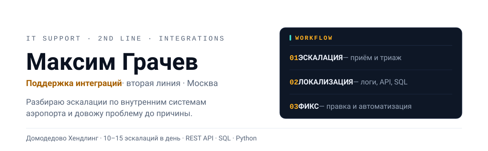
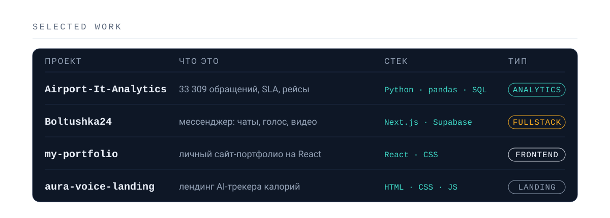
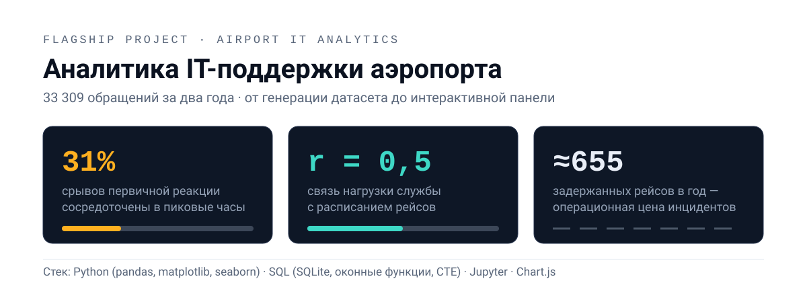
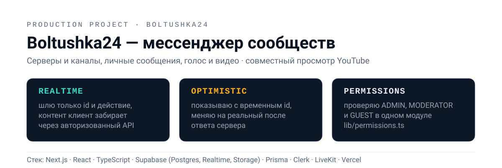
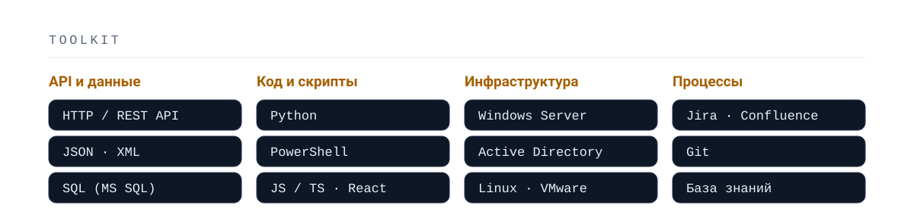

  <picture>
    <source media="(prefers-color-scheme: dark)" srcset="assets/hero-dark.svg">
    
  </picture>

  
  

**Аналитик данных.** Превращаю сырые данные в выводы, на которые можно опираться
при принятии решений: от построения датасета и проверки гипотез — до наглядной
визуализации и рекомендаций.

🎓 Студент бакалавриата по направлению **«Прикладная информатика» (09.03.03)**,
профиль **«Искусственный интеллект и анализ данных»** — Московский университет
имени С. Ю. Витте.

---

## 🗂 Проекты

  <picture>
    <source media="(prefers-color-scheme: dark)" srcset="assets/projects-dark.svg">
    
  </picture>

| Проект | Что это | Стек |
| --- | --- | --- |
| **[Airport-It-Analytics](https://github.com/1notlov3/Airport-It-Analytics)** [→ живая панель](https://1notlov3.github.io/Airport-It-Analytics/dashboard/) | Полный цикл аналитики IT-поддержки аэропорта: 33 309 обращений, SLA, влияние инцидентов на рейсы | Python · pandas · SQL · Jupyter |
| **[Boltushka24](https://github.com/1notlov3/Boltushka24)** [→ boltushka24.vercel.app](https://boltushka24.vercel.app) | Мессенджер для сообществ: серверы и каналы, личные сообщения, реалтайм, голос и видео, совместный просмотр YouTube | Next.js · React · TypeScript · Supabase · Prisma · LiveKit |
| **[my-portfolio](https://github.com/1notlov3/my-portfolio)** [→ демо](https://1notlov3.github.io/my-portfolio/) | Личный сайт-портфолио: разделы о себе, навыках и проектах | React · JavaScript · CSS |
| **[aura-voice-landing](https://github.com/1notlov3/aura-voice-landing)** | Лендинг Aura — голосового AI-трекера калорий | HTML · CSS · JavaScript |

---

## ✈️ Разбор: аналитика аэропорта

  <picture>
    <source media="(prefers-color-scheme: dark)" srcset="assets/proof-dark.svg">
    
  </picture>

Полный цикл аналитики на **33 309 обращений** за два года: от генерации
реалистичных данных до интерактивной панели и рекомендаций для руководства.

- 🔍 нашёл узкое место сервиса: **31% срывов первичной реакции**, сосредоточенных в пиковые часы;
- 📈 связал нагрузку службы с расписанием рейсов (**r = 0,5**) — нагрузку можно прогнозировать;
- 💸 оценил операционную цену инцидентов: **≈655 задержанных рейсов в год**;
- 📊 собрал **[живую интерактивную панель](https://1notlov3.github.io/Airport-It-Analytics/dashboard/)** — открой, она интерактивная.

**Стек:** Python (pandas, matplotlib, seaborn) · SQL (SQLite, оконные функции, CTE) · Jupyter · Chart.js

---

## 💬 Разбор: Boltushka24

  <picture>
    <source media="(prefers-color-scheme: dark)" srcset="assets/boltushka-dark.svg">
    
  </picture>

Фулстек-мессенджер для сообществ, доведённый до продакшена:
**[boltushka24.vercel.app](https://boltushka24.vercel.app)**. Серверы и каналы,
личные сообщения, реалтайм, голосовые и видеокомнаты, совместный просмотр
YouTube, роли и права, PWA с офлайн-очередью.

Три решения, которыми проект интересен инженерно:

- 🔒 **Реалтайм без утечек.** Supabase Realtime рассылает только `{ id, action }`, а сам контент клиент дозапрашивает через авторизованные API-роуты — приватные сообщения не уходят в публичный броадкаст;
- ⚡ **Оптимистичная отправка.** Сообщение появляется мгновенно с временным id и подменяется реальным после ответа сервера — интерфейс не ждёт сеть;
- 🛡 **Права в одном слое.** Роли `ADMIN` / `MODERATOR` / `GUEST` проверяются централизованно, а не дублируются по коду, поэтому поведение предсказуемо.

**Стек:** Next.js · React · TypeScript · Tailwind · Supabase (Postgres, Realtime, Storage) · Prisma · Clerk · LiveKit · TanStack Query · Vercel

---

## 🛠 Инструменты

  <picture>
    <source media="(prefers-color-scheme: dark)" srcset="assets/toolkit-dark.svg">
    
  </picture>

**Язык и анализ:** Python · pandas · NumPy · **Визуализация:** Matplotlib · seaborn · Chart.js ·
**Данные:** SQL · SQLite · Excel · **Среда:** Jupyter · Git · VS Code

---

## 🎯 Сейчас в фокусе

- статистика и A/B-тесты;
- продвинутый SQL (оптимизация запросов, аналитические функции);
- второй аналитический проект в портфолио.

---

## 📊 Статистика

  <picture>
    <source media="(prefers-color-scheme: dark)" srcset="https://github-readme-stats.vercel.app/api?username=1notlov3&show_icons=true&locale=ru&hide_border=true&rank_icon=percentile&bg_color=0D1117&title_color=FFB020&icon_color=3ED8C6&text_color=8B99AE">
    
  </picture>
  <picture>
    <source media="(prefers-color-scheme: dark)" srcset="https://github-readme-stats.vercel.app/api/top-langs/?username=1notlov3&layout=compact&locale=ru&hide_border=true&hide=html,css,scss,astro&bg_color=0D1117&title_color=FFB020&text_color=8B99AE">
    
  </picture>

---

## 📫 Как связаться

- Telegram: [@Grachev_M](https://t.me/Grachev_M)
